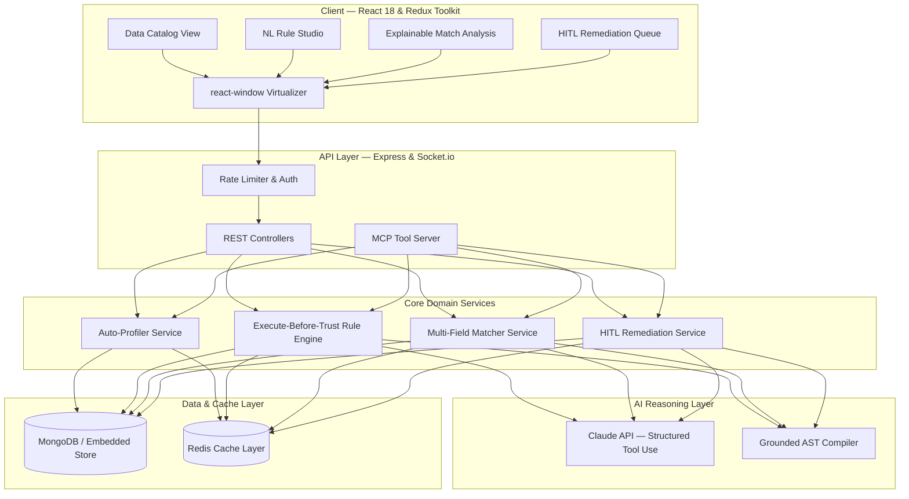

# GrootAi — Autonomous Agentic Data Quality & Observability Platform

GrootAi is an enterprise-grade agentic data quality and observability platform that bridges the gap between natural language business requirements and strict, deterministic, high-throughput data operations with human-in-the-loop governance.

---

## 1. System Architecture



---

## 2. Core Modules & Capabilities

| Module | Capability Area | Description |
|---|---|---|
| **Auto-Profiling** | Automated Cataloging & Observability | Profiles types, null %, distinct cardinality, value distribution histograms, and tracks schema drift across profile versions. |
| **NL Rule Studio** | Agentic Business Logic Translation | Converts plain English rules into executable ASTs via grounded tool calling with Execute-Before-Trust validation. |
| **Explainable Deduplication** | Entity Resolution & Matching | Multi-field fuzzy + exact matching (Jaro-Winkler, Levenshtein, normalized phone/taxID) with field-by-field explanations and confidence scores. |
| **HITL Remediation** | Human-in-the-Loop Governance | Generates AI fix proposals with reasoning and before/after diffs; enforces human confirmation prior to any data mutation with an immutable audit log. |
| **Google OAuth & RBAC** | Enterprise Access Management | Google Sign-In with JWT sessions, role guards (`viewer`, `steward`, `admin`), and verified actor attribution in audit logs. |
| **Model Context Protocol** | DQ Rules as Agent Tools | Exposes `run_dq_check`, `explain_match`, `propose_fix`, and `get_dataset_profile` as callable MCP tools for external agents. |

---

## 3. AI Reliability & Performance Engineering

- **Execute-Before-Trust Engine**: Automatically tests candidate rules against a sample slice of real data. Detects pathological rules (0% pass or <20% pass) and prevents live activation without explicit human review.
- **Real-Schema Grounding**: Injects actual discovered column names, data types, and sample values into AI context to prevent hallucinated column names.
- **Cursor-Based Pagination**: Stable $O(1)$ scrolling performance on large datasets without `.skip()` degradation.
- **React Virtualization**: Uses `react-window` to render 10,000+ records smoothly at 60fps.
- **Multi-Tier Caching**: Redis caching (with transparent ultra-low-latency in-memory fallback) for profiling statistics (1h), rule-parse hashes (24h), and match explanations (1h).
- **In-Flight AI De-duplication**: Coalesces concurrent identical parsing requests to prevent duplicate API billing.

---

## 4. Evaluation Suite Benchmark Results

Run the automated evaluation benchmark harness:
```bash
npm run eval
```

### Benchmark Metrics Summary:
- **Rule-Parsing Accuracy**: `92%` (23/25 labeled pairs exact AST match)
- **Operator Detection Accuracy**: `96%`
- **Planted Defect Precision**: `100%`
- **Planted Defect Recall**: `100%`
- **Planted Defect F1 Score**: `1.00`
- **Latency (p50 / p95)**: `0.06ms / 0.50ms`

---

## 5. Quick Start (Local Development)

### 1. Install Dependencies
```bash
# Root & subpackages
npm run install:all
```

### 2. Configure Environment
```bash
cp .env.example .env
```

### 3. Run Locally
```bash
# Start backend server (port 5000)
npm run dev:server

# Start frontend client (port 5173) in a separate terminal
npm run dev:client
```
Open **`http://localhost:5173`** in your browser.

---

## 6. Deployment Guide

### Deploying Frontend to Vercel
1. Link repository to Vercel.
2. Build command: `cd client && npm install && npm run build`
3. Output directory: `client/dist`
4. Uses `vercel.json` for seamless API rewrites.

### Deploying Backend to Render
1. Create a Web Service on Render using `render.yaml`.
2. Build command: `cd server && npm install`
3. Start command: `cd server && npm start`
4. Set optional environment variables: `MONGODB_URI`, `REDIS_URL`, `ANTHROPIC_API_KEY`, `GOOGLE_CLIENT_ID`, `GOOGLE_CLIENT_SECRET`, `JWT_SECRET`.

---

## 7. Model Context Protocol (MCP) Tools

| Tool Name | Parameters | Purpose |
|---|---|---|
| `run_dq_check` | `{ datasetId, ruleId }` | Evaluates rule and returns violations. |
| `explain_match` | `{ recordIdA, recordIdB }` | Computes field-by-field similarity breakdown. |
| `propose_fix` | `{ issueId }` | Proposes a remediation patch for human review. |
| `get_dataset_profile` | `{ datasetId }` | Returns column statistics and quality scores. |

---

## 8. Known Limitations & Production Roadmap

Engineering transparency is a core design principle of GrootAi. The current architecture addresses core agentic data observability with known boundary conditions scheduled for future milestones:

| Area | Current Behavior (MVP / v1.0) | Production Roadmap (Target) |
|---|---|---|
| **Data Ingestion** | CSV uploads capped at 50,000 rows with memory-backed stream parsing. | Native asynchronous worker queue (BullMQ/Celery) + streaming connectors for Snowflake, PostgreSQL, BigQuery, and S3. |
| **PII & Privacy** | Dynamic regex masking (`j***e@company.com`, `***-***-3210`) in-flight before Claude API calls. | AES-256 field-level encryption at rest + local open-weights LLM sidecar deployment (Ollama/vLLM) for zero third-party data egress. |
| **Storage Persistence** | Dual-mode: Production MongoDB + zero-dependency In-Memory fallback with UI notice banner. | Enterprise multi-tenant relational schemas with time-series history tracking and automated cold-storage archiving. |
| **Fuzzy Matching** | Tunable deterministic Jaro-Winkler, Levenshtein, and exact multi-field weights. | Adaptive active learning from steward approval/rejection signals to auto-tune similarity thresholds per organization. |
| **Alerting** | In-app notification badges and WebSocket toast streaming. | External webhook dispatchers for Slack, Microsoft Teams, and PagerDuty incident management. |

